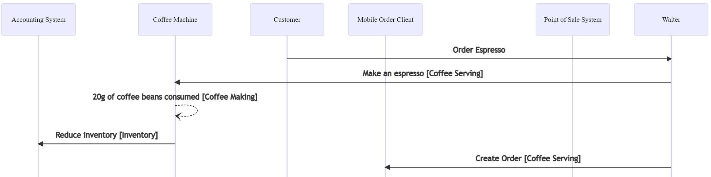

= Featdoc - Feature Documentation as Code
:toc:

featdoc

* is a documentation-as-code tool, which generates wiki pages in Markdown syntax including Mermaid diagrams.
* generates complete sequence diagrams from interacting systems, defined by simple rules

== Example

The example models a restaurant.
From the https://github.com/Calpano/featdoc/tree/main/src/test/java/de/xam/featdoc/example[source code], the resulting markdown is deployed to an Azure DevOps wiki, the https://dev.azure.com/itmv/Coffee%20Shop/_wiki/wikis/Coffee-Shop.wiki/3/FeatDoc[Coffee-Wiki] (and https://dev.azure.com/itmv/Coffee%20Shop/_wiki/wikis/Coffee-Shop.wiki/5/Lunch-Customer-(in-a-hurry)[here] is the sequence diagram above).

.Technical Model
* Create a `Universe`
----
Universe UNIVERSE = new Universe();
----

* Create a `System`
----
System WAITER = UNIVERSE.system("waiter", "Waiter", "Waiter");
----

* Define a `Rule` within a system (grouped by `Feature`)
----
WAITER.feature("Coffee Serving")
  .rule(orderEspresso, CoffeeMachine.espresso, MobileOrderClient.createOrder, MobileOrderClient.addItemToOrder)
  .rule(customerWantsToPay, MobileOrderClient.createBill, Customer.receiveBill);
----
* Create some more systems and rules

* Create a `Scenario`
----
Systems.UNIVERSE.scenario("Lunch-Customer (in a hurry)")
  .step(CUSTOMER, Waiter.orderEspresso)
  .step(CUSTOMER, Waiter.customerWantsToPay, "Today no credit cards");
----
* Generate in one go wiki pages for each system and each scenario

.The World of Coffee
****
[plantuml]
....
hide circles
hide empty members
class Customer
class Waiter
class CoffeeMachine
class MOC as "Mobile Order Client"
class POS as "Point of Sale System"
class ACC as "Accounting System"
Customer ..> Waiter : orders, payment
Waiter --> MOC : digitalization
Waiter --> CoffeeMachine : actual coffee making
MOC --> POS : stores all orders
POS --> ACC : taxes, stock
....

Compare the hand-drawn domain image with the https://dev.azure.com/itmv/Coffee%20Shop/_wiki/wikis/Coffee-Shop.wiki/3/FeatDoc[featdoc auto-generated system diagram].
****

.Configuration
* The example https://github.com/Calpano/featdoc/blob/main/src/test/java/de/xam/featdoc/example/CafeWiki.java[WikiContext] defines the mermaid block style, an optional preamble for all pages, the language (en or de), as well as some paths.
* The example https://github.com/Calpano/featdoc/blob/main/src/test/java/de/xam/featdoc/example/RestaurantSystemsAndScenarios.java[technical model] is just one class. Larger models can be split up into multiple files, e.g. one per system.

== Getting Started
. Add feat as a test dependency

+
.Maven Coordinates
----
<!-- https://mvnrepository.com/artifact/de.xam/featdoc -->
<dependency>
    <groupId>de.xam</groupId>
    <artifactId>featdoc</artifactId>
    <version>1.0.0</version>
</dependency>
----
Check latest version: https://mvnrepository.com/artifact/de.xam/featdoc[]

. Define your technical model
** Create a `Universe` -- see the <<Example>>

. Generate wiki pages
** `wikiContext`: Configure resulting wiki syntax (Azure DevOps Mermaid Blocks vs. Normal)
** Run featdoc tool
+
----
FeatDoc.generateMarkdownFiles( universe, wikiContext );
----

. Take generated wiki pages live
** For Azure DevOps wiki: Upload via `git push`

== Concept
. The core idea is to model isolated systems, each containing simple rules:
Mapping one **trigger** to multiple **actions**.
Each system has an API defined by **messages**, which are **incoming** (such as REST API calls) or **outgoing** (such as business events).
Rules are grouped into features. This just makes organising them easier.

+
.Rule
[plantuml,rule,svg]
....
hide circles
hide empty members

package Rule {
class Trigger {
    Message
    comment
}
class Action {
    Message
    comment
}

Trigger "1" -> "n" Action : rule
}
....

. A **scenario** now merely defines an initial **trigger**, causing a chain reaction of systems sending messages to each other. As one rule can cause several actions, the result can be rendered tree-like or as a sequence diagram.

. A **message** is produced by one system (or a scenario) and consumed by zero or more systems (as defined in its rules).
** A message is defined by a system.
E.g. the vendor of the system defines the message structure and contents.
Also, the vendor will likely provides API docs for the message.
** Typical messages are *API calls* (incoming & synchronous) or *business events* (outgoing & asynchronous).
+
.Kinds of Messages
[%header,cols="1e,1e,4a",width=60%]
|===
| Direction | Timing a| Examples
.2+| incoming .2+| synchronous a| API call in a REST API
a| User interface input (e.g. click)
.2+| outgoing .2+| synchronous a| REST Callback/Web Hook
a| User interface result (any UI reaction)
| incoming | asynchronous a| Incoming event
| outgoing | asynchronous a| Outgoing (business) event
|===

== Cookbook
How do I model conditional rule actions?::
You can't. But you can add a **comment** to a rule action, which will be visible in all generated views.
+
[source, java]
----
MYSYSTEM.feature("my feature")
    .rule(triggerMessage, optionalTriggerComment)
        .action(actionMesage, optionalActionComment)
        // more actions
    .build;
----

How to represent scheduled calls?::
Define a `System` called "Scheduler" with **messages** like
+
[source, java]
----
System SCHEDULER = UNIVERSE.system("scheduler", "Scheduler", "Scheduler");
Message schedulerEvery2Minutes = SCHEDULER.asyncEventOutgoing("Every 2 Minutes");
----
and invoke them from the **scenario**.

How to model my systems?::
. Create all systems in one interface
+
[source,java]
----
interface Systems {
    Universe UNIVERSE = new Universe();
    System CUSTOMER = UNIVERSE.system("customer", "Customer", "Customer");
    System WAITER = UNIVERSE.system("waiter", "Waiter", "Waiter");
    System CM = UNIVERSE.system("coffee", "Coffee Machine", "CoffeeMachine");
    System MOC = UNIVERSE.system("moc", "Mobile Order Client", "Mobile");
    System POS = UNIVERSE.system("pos", "Point of Sale System", "POS");
    System ACC = UNIVERSE.system("accounting", "Accounting System", "Accounting");
}
----

. Model each `System`'s rules within an interface, like this
+
[source,java]
----
/** Point-of-Sale System */
interface PosSystem {

    Message createOrder = POS.apiCall("Create order for table");
    Message searchOrdersForTable = POS.apiCall("Search order of given table");
    Message addItemToOrder = POS.apiCall("Add item");
    Message addTaxesToOrder = POS.apiCall("Add taxes");

    static void define() {
        POS.feature("Tax Integration")
                .rule(addItemToOrder, AccountingSystem.calculateTax, addTaxesToOrder);
    }
}
----

== Resources
* https://en.wikipedia.org/wiki/Markdown[Markdown]:
https://daringfireball.net/projects/markdown/syntax[syntax],
https://help.github.com/articles/github-flavored-markdown/[Github-flavored Markdown],
https://learn.microsoft.com/en-us/azure/devops/project/wiki/wiki-markdown-guidance?view=azure-devops[syntax in Azure DevOps Wiki]

* Mermaid:
https://mermaid-js.github.io/mermaid/#/[docs],
https://mermaid.live/[online editor]

* featdoc:
link:details.adoc[]
